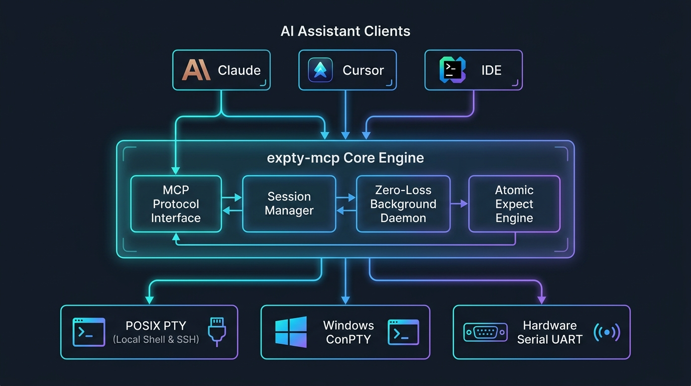

# expty-mcp

[](https://pypi.org/project/expty-mcp/)
[](https://pypi.org/project/expty-mcp/)
[](https://opensource.org/licenses/MIT)

**`expty-mcp`** is a high-performance **Model Context Protocol (MCP)** server that equips AI assistants (Claude Code, Cursor, Antigravity, VS Code) with persistent, zero-loss **Interactive PTY Process and Serial Communication** capabilities.

Engineered specifically for **persistent SSH sessions, remote server administration, local shells, REPLs, container debugging, and hardware serial ports (UART/U-Boot)**. It features an **Atomic Expect Engine**, continuous background ingestion daemon, transport-level microsecond timestamping with intelligent 50ms continuation detection, and full cross-chunk ANSI sanitization.

---

## Architecture Design

<p align="center">
  
</p>

---

## Key Features

- **Zero-Loss Background Daemon**: Dedicated reader daemon continuously ingests bytes into memory in real time—eliminating dropped output during LLM reasoning pauses.
- **Unified PTY & Serial Transports**: Seamlessly spawn local processes (`bash`, `python`, `gdb`), SSH sessions (`ssh user@router`), or connect to physical UART devices (`/dev/ttyUSB0`, `COM3`).
- **Accurate Transport-Level Timestamping**: Timestamps are stamped at the moment bytes leave the OS kernel/driver system call, avoiding queue or scheduling jitter.
- **Smart 50ms Packet Continuation**: 
  - Packet fragments arriving within `< 50ms` are smoothly merged into a single line.
  - Fragments arriving after `>= 50ms` (e.g. driver pause, slow command) are split into separate lines tagged with `↳ ` and their own timestamp—enabling effortless correlation against test framework logs (Pytest, RobotFramework).
- **Atomic Expect Engine (`expect`)**: Match regex or substring prompt patterns atomically (`['password:', '# ', '>>>']`) with buffer slicing and retention.
- **Prompt-Aware Execution (`exec_expect`)**: Send commands and wait for prompt return in a single call, returning structured JSON results with execution status, optional `check_exit_code_cmd` probe, and `interrupt_on_timeout` recovery.
- **Causal Anchor Preservation**: Preserves command echo in output streams, providing LLMs with an unbroken causal chain for self-correction without regex stripping bugs.
- **Cross-Chunk ANSI & Backspace Sanitization**: Intelligently handles split escape sequences (e.g. `\x1b[` in chunk 1 and `31m` in chunk 2) and terminal cursor backspace (`\b` / `0x08`) line-editor overwriting artifacts.
- **Thread-Safe Multi-Session Management**: Concurrently manage multiple terminal sessions with strict session guarding and double-checked locking auto-spawn.
- **Fast Process Exit Detection**: Instantly detects when a child process or SSH connection terminates, returning exit codes immediately without waiting for timeouts.
- **Periodic Injection (`poll_cmd`)**: Inject keepalive characters or autoboot interrupt keys (e.g. spaces for U-Boot) at high frequency during expect wait windows.
- **100% Cross-Platform**: Native POSIX PTY on Linux & macOS (`ptyprocess`), leak-free Windows ConPTY worker queue (`pywinpty`), and cross-platform Serial support (`pyserial`).

---

## Available MCP Tools

| Tool | Description |
| :--- | :--- |
| **`spawn`** | Spawn a new interactive process (`bash`, `ssh user@host`, `python`, `gdb`, etc.) in a native PTY. |
| **`serial`** | Connect to a physical or virtual serial port (`/dev/ttyUSB0`, `COM3`). |
| **`exec_expect`** | Execute a command and wait for prompt to return, returning structured execution status and clean output. Supports `check_exit_code_cmd` probe and `interrupt_on_timeout`. |
| **`expect`** | Atomically send a command and wait for regex patterns (ideal for SSH login / prompt sync / bootloader interception). Supports `interrupt_on_timeout`. |
| **`send`** | Send raw keys or escape sequences (e.g. `\x03` for Ctrl+C, `\x1b` for Escape, Enter). Supports parameter aliases (`data`, `input`, `command`). |
| **`read_buffer`** | Non-blocking read of newly accumulated stream buffer with backspace folding. |
| **`get_history`** | Fetch recent line history. By default, formats with `[YYYY-MM-DD HH:MM:SS.mmm]` and `↳ ` continuation markers. |
| **`list_sessions`**| List all active PTY and Serial sessions with runtime health status. |
| **`switch_session`**| Switch the default active session (most tools accept `session_id` directly without switching). |
| **`close_session`** | Terminate and cleanly shut down an active session. |
| **`list_ports`** | Enumerate connected physical and virtual serial ports on the host. |
| **`status`** | Query runtime diagnostics, buffer usage, and transport health. |

---

## Practical Examples

### 1. Persistent SSH Session (No repeated logins)

```json
// Step 1: Spawn SSH connection
// Tool: spawn
{
  "command": "ssh root@192.168.1.1",
  "name": "openwrt-router"
}

// Step 2: Handle password prompt with Expect
// Tool: expect
{
  "patterns": ["password:", "# "],
  "command": "admin",
  "timeout": 10.0
}

// Step 3: Run interactive commands effortlessly
// Tool: exec_expect
{
  "command": "cat /etc/config/network"
}
```

### 2. Time-Correlated Log Analysis (Aligning with Test Frameworks)

```json
// Tool: get_history
{
  "limit": 5,
  "with_timestamps": true
}
```

**Output:**
```text
[2026-09-13 15:30:45.100] [Kernel] Initializing network interface eth0...
[2026-09-13 15:30:45.120] [Kernel] PHY driver link speed: 1000Mbps
[2026-09-13 15:30:45.300] [Kernel] Loading crypto module...
[2026-09-13 15:30:46.850] ↳ done (took 1550ms)
[2026-09-13 15:30:46.870] IPQ807x# 
```
*Notice how the 1.55-second driver pause is clearly split with `↳ `, immediately pinpointing where execution stalled relative to your test runner logs.*

### 3. Interactive Python REPL / Debugger

```json
// Tool: spawn
{
  "command": "python3",
  "name": "python-repl"
}

// Tool: exec_expect
{
  "command": "import math; math.factorial(10)"
}
```

### 4. Hardware UART Bootloader Interception

```json
// Step 1: Open serial port
// Tool: serial
{
  "port": "/dev/ttyUSB0",
  "baudrate": 115200
}

// Step 2: Interrupt autoboot with high-frequency space injection
// Tool: expect
{
  "patterns": ["IPQ807x#", "U-Boot#"],
  "poll_cmd": " ",
  "poll_interval": 0.05,
  "timeout": 15.0
}
```

---

## Installation & Configuration

### Option 1: Fast Zero-Install with `uvx` (Recommended)

No manual installation required. MCP clients can run `expty-mcp` directly via Astral `uv`:

```bash
# Run directly from PyPI
uvx expty-mcp
```

### Option 2: Install via `pip` or `uv`

```bash
# Using uv
uv pip install expty-mcp

# Or using standard pip
pip install expty-mcp
```

### Option 3: From Source (Editable Mode)

```bash
git clone https://github.com/weyou/expty-mcp.git
cd expty-mcp
uv pip install -e .
```

---

## Client Configuration

### 1. Claude Desktop / Claude Code

**Using `uvx` (Zero-Install, Recommended):**
```json
{
  "mcpServers": {
    "expty": {
      "command": "uvx",
      "args": ["expty-mcp"]
    }
  }
}
```

**Using installed Python environment:**
```json
{
  "mcpServers": {
    "expty": {
      "command": "python3",
      "args": ["-m", "expty_mcp"]
    }
  }
}
```

### 2. Antigravity / Google AI Assistant
Add to `~/.gemini/config/mcp_config.json`:

```json
{
  "mcpServers": {
    "expty": {
      "command": "uvx",
      "args": ["expty-mcp"]
    }
  }
}
```

### 3. Cursor IDE
Add to `.cursor/mcp.json` or Cursor Global Settings:

```json
{
  "mcpServers": {
    "expty": {
      "command": "uvx",
      "args": ["expty-mcp"]
    }
  }
}
```

---

## Testing & Code Quality

```bash
pytest -v
ruff check .
```

---

## License

This project is licensed under the [MIT License](LICENSE).
